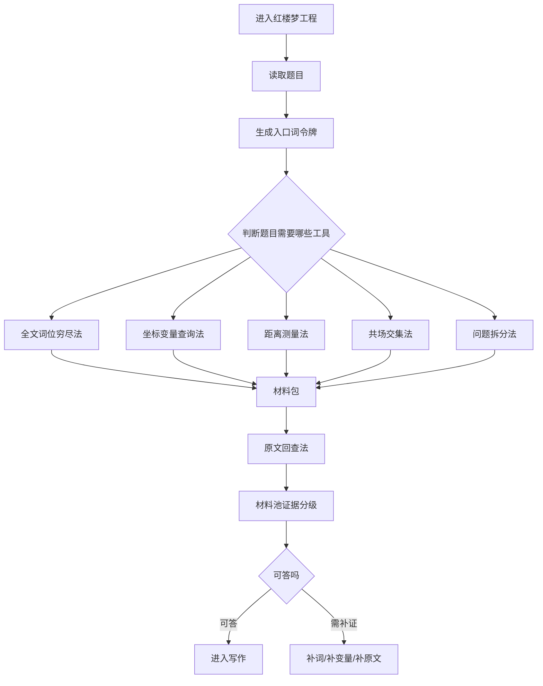

# 红楼梦坐标取材总线工具运用方法说明

这套工具的核心不是“多开几个搜索门”，而是给红楼梦工程一个统一取材入口：

```text
material_pack(question)
```

它的原则是：

```text
先取材，后写作。
没有材料包，不进入答案。
```

## 一、总流程图



## 二、各工具什么时候用

## 二点五、坐标路必须先拿到的令牌

坐标查法不能一进来就用表。它必须先通过坐标预检门。

```text
题目
-> 坐标入口令牌
-> 入口词令牌
-> 词角色令牌
-> 强复合轴令牌
-> 方法调度令牌
-> 距离/共场令牌
-> 来源顺序令牌
-> 材料升级令牌
-> 原文裁判令牌
-> 才允许查坐标表和词位表
```

令牌说明：

| 令牌 | 是否硬令牌 | 作用 |
|---|---|---|
| 坐标入口令牌 | 是 | 确认本题走坐标路，不回落语义路。 |
| 入口词令牌 | 是 | 必须有 `Codex查询词`；坐标路不从题面裸猜词。 |
| 词角色令牌 | 建议 | 区分主查人物、物象、场景词、归一词、扩展词、背景锚点。 |
| 强复合轴令牌 | 多对象题为硬令牌 | 告诉程序哪些对象必须共同成立，防止单边材料冒充关系证据。 |
| 方法调度令牌 | 是 | 判断本题该走词位、坐标、距离、共场、全量、综合、原文哪几路。 |
| 距离/共场令牌 | 最近/同场题为硬令牌 | 形成两两关系，不能只看单词命中。 |
| 来源顺序令牌 | 建议 | 告诉程序先查哪个库、再回哪个原文入口。 |
| 材料升级令牌 | 建议 | 说明什么候选能进入材料池，防止命中直接变答案。 |
| 原文裁判令牌 | 是 | 所有候选必须回原文和材料池裁判。 |

硬规则：

```text
缺坐标入口令牌：不进入坐标路。
缺入口词令牌：停在坐标预检门，不允许裸查。
缺方法调度令牌：不能用表。
缺距离/共场令牌：最近/同场题不能下判断。
缺原文裁判令牌：不能入最终答案。
```

## 二点六、坐标距离与交集概念卡

坐标查询必须先理解四个基础概念：

```text
坐标点：一个对象在原子段、场面、事件、时间块里的落点。
距离：两个对象在坐标系统里的远近。
交集：两个对象在某一层坐标容器上的距离为 0。
放大层级：原子段没有交集时，向场面、事件、回目逐层放大。
```

这四个概念必须在查表前就进入判断，不是查完以后临时解释。

### 0. 四个概念一句话

```text
坐标点：对象在哪里。
距离：两个对象隔多远。
交集：两个对象距离为 0。
放大：这一层没有 0，就升到上一层再看有没有 0。
```

### 1. 坐标距离是什么

坐标距离不是普通语义相似，也不是“同一回”就算近。

坐标距离的层级如下：

| 距离层级 | 含义 | 证据强度 |
|---|---|---|
| `same_atom` | 两个对象在同一个原子段 | 最强 |
| `same_scene` | 两个对象在同一个场面 | 很强 |
| `same_event` | 两个对象在同一个事件 | 中强 |
| `same_time_block` | 两个对象在同一时间块 | 辅助 |
| `same_chapter` | 两个对象在同一回 | 弱背景 |
| `atom_distance=N` | 两个对象相隔 N 个原子段 | 用来排序近远 |
| `no_container_intersection` | 没有共同容器 | 只能作近邻或需补证 |

判断顺序：

```text
先看 same_atom
再看 same_scene
再看 same_event
再看 same_time_block
最后才看 same_chapter 和 atom_distance
```

硬规则：

```text
same_chapter 不能冒充 same_scene。
atom_distance=0 才是同原子段。
同回但不同场，只能降级为背景。
```

### 2. 交集是什么

交集不是“都出现过”，而是对象点集在某个容器里共同成立。

更准确地说：

```text
交集 = 某一层坐标距离为 0
```

也就是：

```text
same_atom = 原子段层距离为 0
same_scene = 场面层距离为 0
same_event = 事件层距离为 0
same_time_block = 时间块层距离为 0
same_chapter = 回目层距离为 0
```

所以“交集”不是一个单独的玄学概念，它就是距离法里的零距离状态。

例如：

```text
林黛玉点集
黄字点集
-> 求共同 atom / scene / event / time_block
```

交集层级：

```text
原子段交集：两个对象在原子段层距离为 0。
场面交集：两个对象在场面层距离为 0。
事件交集：两个对象在事件层距离为 0。
时间块交集：两个对象在时间块层距离为 0。
回目交集：两个对象在回目层距离为 0，只能说明同回背景。
```

多对象题必须做两两交集。

例如：

```text
宝玉、黛玉、秋天、花
```

不能直接一锅查，必须拆成：

```text
宝玉-黛玉
宝玉-秋天
宝玉-花
黛玉-秋天
黛玉-花
秋天-花
```

每一对都要输出：

```text
left
right
level
distance_value
nearest_left_atom
nearest_right_atom
same_atom_count
same_scene_count
same_event_count
same_time_block_count
```

### 3. 坐标距离和交集怎么一起用

```text
先用交集判断是否共同成立。
再用距离判断哪个共同点最近、最强。
再回原文判断这个共同点能不能回答问题。
```

例子：

```text
问：林黛玉和黄字离得最近的是哪一回？

1. 林黛玉 -> 坐标变量点集。
2. 黃/黄 -> 全文词位点集。
3. 求两者 same_atom / same_scene / same_event。
4. 若 same_atom 存在，atom_distance=0。
5. 若多处 same_atom，再按回序、字位、原文语境排序。
6. 最后回原文句子，判断是硬位置还是文学解释。
```

### 4. 给程序的判断口令

坐标路在取材前必须记住：

```text
距离负责远近；
交集负责共同成立；
同回不是同场；
同场不是同段；
同段最强但仍要回原文；
没有共同容器时，不许硬写结论。
```

### 1. 全文词位穷尽法

使用条件：

- 题目里有明确字词、短语、物件名、诗句、原文片段。
- 题目问“哪里有”“哪一回”“第一次”“最早”“全书所有”。
- 坐标变量库没有收录某个裸词、小词、小物、小动作。

典型例子：

```text
鸡、狗、一根、乌眼鸡、酸笋鸡皮汤、鸡声茅店月、黄、花、灯、药
```

操作方法：

```text
入口词 -> 全文词位库 -> 取全部出现位置 -> 按回目/字位排序 -> 映射原子段
```

输出重点：

```text
term_surface
chapter_no
start_char / end_char
atom_code
old_segment_no
source_sentence
cross_atom
```

注意：

词位穷尽法只负责“把点全部找出来”，不能直接写结论。

### 2. 坐标变量查询法

使用条件：

- 题目里有人物、空间、季节、物件、行动、事件关系。
- 题目需要区分同名或同字。

典型例子：

```text
林黛玉、贾宝玉、潇湘馆、秋天、春天、花、药、送、哭、病
```

操作方法：

```text
入口词 -> 名称归一 -> 变量类型判断 -> 坐标变量库 -> 原子段/场/事件/时间块
```

关键区分：

```text
season=春 不是 person=惜春
person=林黛玉 不是 裸词“黛”
space=潇湘馆 不是 任意含“潇湘”的文本
```

输出重点：

```text
variable_type
variable_value_name
confidence
atom_code
scene_id
event_id
time_block_id
```

### 3. 距离测量法

使用条件：

- 题目问最近、靠近、相邻、离得最近、接近状态。
- 题目包含两个以上对象，需要判断它们远近。

操作方法：

```text
A对象坐标点
B对象坐标点
-> 两两计算
-> same_atom / same_scene / same_event / same_chapter
-> 再看原子段数字距离
```

距离强弱：

```text
same_atom：最强，两个对象在同一原子段。
same_scene：强，在同一场面。
same_event：中，在同一事件。
same_chapter：弱，只能作为背景。
no_container_intersection：无共同容器，只能按近邻或补证。
```

输出重点：

```text
left
right
level
distance_value
nearest_left_atom
nearest_right_atom
same_atom_count
same_scene_count
same_event_count
```

### 4. 共场交集法

使用条件：

- 题目问两个人是否同场。
- 题目问人和物是否同场。
- 题目问季节、空间、人、物是否同时成立。

操作方法：

```text
对象A点集
对象B点集
对象C点集
-> 求共同容器
-> 先原子段
-> 再场面
-> 再事件
-> 最后才看同回背景
```

输出重点：

```text
same_atom_or_direct
same_scene
same_event
same_time_block
```

注意：

同回不是同场。同回只能说明背景接近，不能直接证明同场。

### 5. 原文回查法

使用条件：

所有候选材料出来以后都必须使用。

操作方法：

```text
atom_code / chapter_no / char_pos
-> 回全文取句
-> 必要时取前后文
-> 判断这条材料是主证、背景、误召回还是需补证
```

输出重点：

```text
source_sentence
source_atoms
source_sentences
warnings
status
```

注意：

坐标库负责定位，词位库负责穷尽，最后裁判必须看原文。

### 6. 问题拆分法

使用条件：

- 问题复杂。
- 有多变量、多关系、比较、对照、阶段判断。

不使用条件：

- 简单字词查询不要机械拆。

操作方法：

```text
原问题
-> 子问题
-> 每个子问题的变量组
-> 两两关系
-> 汇总裁判
```

例子：

```text
宝玉和黛玉在秋天跟花比较接近的状态
```

拆为：

```text
宝玉
黛玉
秋天
花
接近状态
```

再查：

```text
宝玉-黛玉
宝玉-秋天
宝玉-花
黛玉-秋天
黛玉-花
秋天-花
```

## 三、调度规则表

| 题目特征 | 先用工具 | 加用工具 | 最后必须 |
|---|---|---|---|
| 有明确字词/短语 | 全文词位穷尽法 | 坐标变量查询法 | 原文回查 |
| 有人物/空间/季节/物件 | 坐标变量查询法 | 词位兜底 | 原文回查 |
| 问最近/靠近/相邻 | 坐标变量查询法 | 距离测量法 | 原文回查 |
| 问同场/一起/同时 | 坐标变量查询法 | 共场交集法 | 原文回查 |
| 问第一次/最早/全书哪里 | 全文词位穷尽法 | 坐标排序/距离 | 原文回查 |
| 问比较/对照/多关系 | 问题拆分法 | 两两距离/共场 | 原文回查 |
| 概念词如亲密/冷淡/照顾 | 语义解释成可查变量 | 坐标验证/原文验证 | 原文回查 |

## 四、硬原则

1. 没有材料包，不写答案。
2. 语义只能帮助理解和扩词，不能当裁判。
3. 同回不是同场。
4. 不为单题写特殊规则，只写通用调度。
5. 保留名称归一、问题拆分、两两比较、材料池、原文裁判、证据分级。

## 五、材料包字段

```text
question
query_type
variables
term_hits
coordinate_hits
nearest_pairs
cooccurrence
source_atoms
source_sentences
warnings
status
rows
```

## 六、当前接入位置

坐标取材总线已经接入：

```text
/Users/yu/Documents/Codex/2026-06-03/notion-3-crv/work/formal_honglou_coordinate_material_gate.py
```

主工程分流位置：

```text
/Users/yu/Documents/Codex/2026-06-03/notion-3-crv/work/formal_honglou_question_evidence_pool.py
```

当前总线字段：

```text
coordinate_preflight_status
coordinate_preflight_rule
coordinate_preflight_tokens
coordinate_missing_required_tokens
coordinate_missing_optional_tokens
coordinate_tool_usage_guide
material_query_type
material_variables
material_term_hits
material_coordinate_hits
material_nearest_pairs
material_cooccurrence
material_source_atoms
material_source_sentences
material_warnings
material_status
```

一句话：

```text
入口词负责把问题变成可查对象；
词位法负责穷尽；
坐标法负责归属；
距离法负责远近；
共场法负责共同容器；
原文法负责裁判；
材料池负责决定能不能写。
```
