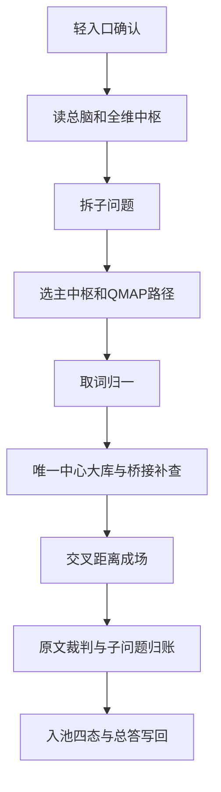

# 138_红楼梦人工智能咨询工程_八步法与13步机器环境合一说明_20260624

生成时间：2026-06-24

性质：流程方法说明 / 八步法的机器环境解读 / 一文件双检索入口

对应机器复原点：

```text
137_红楼梦人工智能咨询工程_机器硬化复原点_唯一最优版_20260624.json
```

## 一句话定案

八步法、九步现场裁决、13步机器流程、策略组、短账卡都不再各说各话。

最后状态只有一个：机器先理解全维中枢网，再把问题拆成可查子问题，为每条子问题选择主中枢和查询路径，生成 QMAP，进入唯一中心大库，桥接补查，交叉成场，回原文裁判，按子问题归账，最后入池或放行总答。

数字只是机器编号，不能抢走工程重点；入口口令、旧四件套、旧小库名称都降为兼容或历史说明。

但入口口令不能被机器绕过。它只写成一条轻入口确认 CK-00，不长篇解释；没有 CK-00，不得进入总脑、拆题、QMAP 或查库。

## 合一后正式名称

合一后的正式总名：**全维中枢运行总法**。

这个名称专门用来收束所有旧数字和旧说法：八步法、九步现场裁决、13步机器环境、策略组、短账卡、全维中枢网，都属于这一套总法的不同侧面。

以后机器要这样查：

```text
问八步法 -> 查全维中枢运行总法。
问13步 -> 查全维中枢运行总法。
问当前总流程 -> 查全维中枢运行总法。
问怎么拆题、怎么选中枢、怎么QMAP -> 查全维中枢运行总法。
```

文件职责：`000C` 负责进门记住它；`000E_B` 负责按它选策略和 QMAP；`137 JSON/MD` 负责按它复原；本文件负责解释它为什么是合一后的同一套东西。

## 数字压缩后的最终口径

这些数字现在不再并列抢解释权。前台给人和机器看的执行口径压缩；底层需要恢复、阻断和审计的字段保留。

| 旧说法 | 最终处理 | 压缩后怎么理解 | 理由 |
|---|---|---|---|
| 八步法 | 压成六步证据法，旧名只作检索别名 | 拆题定路 -> 取词归一 -> 入库收点 -> 交叉成场 -> 原文裁判 -> 入池输出 | 旧八步里的读题/判型/拆对象/定主轴已经合入“拆题定路”；归一和取词合并；放宽属于交叉成场。 |
| 九步现场裁决 | 压成六步现场裁决 | 归一收点 -> 交集找候选 -> 成场开窗 -> 分类与在场等级 -> 场点性质与原文强场 -> 入池输出 | 现场裁决真正要守住的是候选、成场、分类、在场强弱、原文强场和入池，不必让机器背九个小格。 |
| 13步机器环境 | 人读九步版 + 底层13字段保留 | CK-00轻入口 -> 读总脑 -> 拆子问题 -> 主中枢/QMAP -> 取词归一 -> 大库与桥接 -> 交叉成场 -> 原文裁判/归账 -> 入池/总答 | 13个 HLM-AI 字段适合机器恢复和阻断；日常执行用九步更顺。 |
| 旧六策略组 | 压成四策略组 | 入门拆题与路径 / 取词查表与成场 / 原文裁判与入池 / 交互修正与交付复盘 | QMAP 不是独立策略组，属于拆题路径；子问题闭环不是独立策略组，归入裁判入池。 |
| 短账卡 | 不压缩，只归入四策略组 | CK/SQ/QMAP/TS/HIT/EV/MAT/SQC/ANS 仍要能显示状态 | 短账卡是防绕过的打卡机制，不能为了简化而丢。 |
| 十三中枢 | 不压缩 | 人物、人物关系、命运、话语、性主题、描写、空间、路线、时间、事件、诗词、物象、意义作用 | 这是大库内容地图，不是流程步骤；压缩会丢入口能力。 |

## 检索词

| 检索词 | 应落文件 | 解释 |
|---|---|---|
| 八步法 / 8步法 | 138 本文件 | 旧名保留，当前按六步证据法和全维中枢运行总法理解。 |
| 九步 / 现场裁决 | 87 总规则 + 138 本文件 | 旧名保留，当前按六步现场裁决理解。 |
| 13步 / 十三步 | 138 本文件 + 137 JSON | 底层机器合同保留 13 字段；日常执行看人读九步版。 |
| 全维中枢网 | 000E_B + 138 本文件 | 当前大库真实结构和查询入口思想。 |
| QMAP / 路径编排 | 87 运行卡 + 000E_B + 138 本文件 | 子问题进入大库前的入口映射。 |
| 短账 / 打卡 | 87 运行卡 + 000C + 000E_B | 流程是否真的完成的核查机制。 |

## 总理解

```text
六步证据法 = 底层查证习惯：拆题、取词、入库、交叉、回原文、入池输出。
六步现场裁决 = 现场真假强弱判断：候选、成场、分类、在场强弱、原文强场、入池输出。
人读九步版 = 日常执行路线：入口、总脑、拆题、路径、取词、大库、成场、裁判、交付。
底层13字段 = 机器恢复和阻断合同：保留 HLM-AI-00 到 HLM-AI-12。
四策略组 = 管每一段工作怎么完成。
短账卡 = 管每一步有没有真的完成，不能压掉。
十三中枢 = 唯一中心大库的内容地图。
```

当前工程不再要求机器背数字，而是要求机器按同一条运行链工作。

## 人读九步总图



## 底层 13 步机器合同与工程位置

| 机器步骤 | 人话名称 | 在工程里做什么 | 对应文件/机制 |
|---|---|---|---|
| HLM-AI-00 | 轻入口确认 | 写 CK-00，确认进入本工程；不展开口令牌细节，但不能跳过。 | 000C |
| HLM-AI-01 | 读总脑与全维中枢 | 先知道一库、十三中枢、多桥接、原文裁判。 | 000C / 000E_B |
| HLM-AI-02 | 拆子问题 | 把复杂题拆成可查、可排序、可汇总的 SQ。 | 87 总规则 / 87 运行卡 |
| HLM-AI-03 | 选主中枢与路径 | 判断从人物、话语、空间、时间、事件、诗词、物象等哪个中枢进入。 | 000E_B 全维编排层 |
| HLM-AI-04 | QMAP入口映射 | 给每条 SQ 生成 domain、intent、axes、入口表、source_back。 | 87 运行卡 / 大库查询矩阵 |
| HLM-AI-05 | 取词归一与强复合 | 取查询词、强复合、词角色；人物/物象/空间等先归一。 | 000C / 000E_B / 人物归一 |
| HLM-AI-06 | 查唯一中心大库 | 用入口表和编码查 atom_code、scene_id、event_id、global_atom_order。 | 坐标查询唯一中心大库 |
| HLM-AI-07 | 桥接与专项补查 | 话语、词位、空间路线、人物扩展、统一证据等只作补查入口。 | 桥接表 / 专项投影 |
| HLM-AI-08 | 交叉距离成场 | 做同点、同场、同事件、距离、放宽层级。 | 六步现场裁决 / 距离共场规则 |
| HLM-AI-09 | 原文窗口裁判 | 回原文判断候选能否证明问题。 | 原文窗口 |
| HLM-AI-10 | 子问题材料归账 | 每条 SQ 写材料词、满意度、补查状态、能否喂下一步。 | 流程短账 / SQ完成卡 |
| HLM-AI-11 | 入池凭证与四态 | 生成取材包和 04 凭证，进入材料池四态。 | 坐标取材包 / 材料池 |
| HLM-AI-12 | 总答放行与写回 | ANS 放行；交互修正回到对应策略组；经验写回正确层。 | 000D / 总账 / 137/138 |

## HLM-AI-05 内部取词归一子动作

这六个动作只属于 `HLM-AI-05｜取词归一与强复合`，不独立升格为机器主步骤。它们必须在子问题和主中枢路径已经明确以后执行。

| 子动作 | 名称 | 机器字段 | 备注 |
|---|---|---|---|
| HLM-AI-05a | 定中心词 | 题目中心 / 题型初判 | 帮助进入主中枢，不替代 SQ。 |
| HLM-AI-05b | 定主查词 | Codex查询词 | 抽出必须成立的核心对象。 |
| HLM-AI-05c | 定强复合 | Codex强复合 | 标明哪些对象必须共同成立。 |
| HLM-AI-05d | 定词角色 | Codex词角色 | 区分主查词、归一词、扩展词、背景锚点、排除词。 |
| HLM-AI-05e | 定查询词策略 | Codex查询词策略 | 说明词为什么这样取舍，并对接 QMAP。 |
| HLM-AI-05f | 定材料升级条件 | Codex材料升级条件 | 规定什么命中可以进入材料池。 |

## 一个问题进来时的实际顺序

```text
000C -> CK-00轻入口 -> 读总脑 -> 拆子问题 -> 主中枢/QMAP -> 取词归一 -> 大库与桥接 -> 交叉成场 -> 原文裁判/归账 -> 入池四态/总答写回
```

## 当前状态

| 位置 | 当前状态 |
|---|---|
| 000C | 已作为工程入口和总脑位置；负责轻入口、全局结构、强制流程和短账卡点。 |
| 000E_B | 已作为策略控制层；负责全维中枢、主路径选择、策略组和具体查询方法。 |
| 135 总账 | 已挂 137 唯一最优版复原点，并记录八步法静态验收通过。 |
| 136 严审报告 | 已升级指向 137 机器硬化复原点。 |
| 137 JSON | 保存13步机器硬化合同、HLM-AI-05内部取词归一子动作、短账与阻断条件。 |
| 137 MD | 已有人读复原点说明，并指向本合一说明。 |
| 138 本文件 | 八步法与13步机器环境的同一文件。 |

## 最后规则

以后如果问“八步法是什么”，读 138。

如果问“8步法怎么进入工程”，读 138。

如果问“13步是什么”，先读 138，再读 137 JSON。

如果问“十三步机器环境怎么执行”，先读 138，再读 137 JSON。

如果问“机器怎样恢复”，读 137 JSON。

如果问“总入口和当前唯一状态”，读 135。

如果问“进门后第一步怎么做”，读 000C；第一件事是读总脑，不是展开口令牌。

如果问“问题怎样选策略”，读 000E_B；核心是子问题、主中枢、路径、QMAP、原文裁判。
