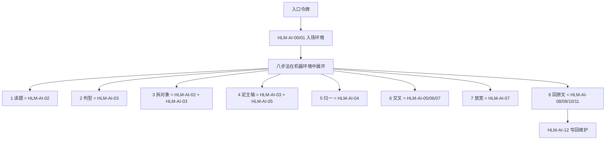

# 138_红楼梦人工智能咨询工程_八步法与13步机器环境合一说明_20260624

生成时间：2026-06-24

性质：流程方法说明 / 八步法的机器环境解读 / 一文件双检索入口

对应机器复原点：

```text
137_红楼梦人工智能咨询工程_机器硬化复原点_唯一最优版_20260624.json
```

## 一句话定案

八步法不是另一套流程；它是人怎样读题、拆题、取材、回原文的查证方法。

13步机器硬化流程也不是另一个方法；它是八步法进入红楼梦人工智能咨询工程以后，在机器环境里的执行形态。

所以：查“八步法 / 8步法”，要落到本文件；查“13步 / 十三步”，也要落到本文件。二者是同一个总体状态的两种读法。

取词细化动作只属于 `HLM-AI-02｜AI读题取词` 内部，不升格为机器主步骤。

## 检索词

| 检索词 | 应落文件 | 解释 |
|---|---|---|
| 八步法 | 138 本文件 | 人的查证方法。 |
| 8步法 | 138 本文件 | “八步法”的数字写法。 |
| 13步 | 138 本文件 + 137 JSON | 八步法在机器环境里的执行合同。 |
| 十三步 | 138 本文件 + 137 JSON | “13步”的汉字写法。 |
| 机器硬化流程 | 138 本文件 + 137 JSON | 机器怎样不走错、缺什么就阻断。 |
| HLM-AI-02 | 138 本文件 + 137 JSON | AI读题取词，内部含六个取词子动作。 |

## 总理解

```text
八步法 = 人的查证方法
13步 = 八步法进入工程后的机器环境
137 JSON = 机器合同和复原点
138 本文件 = 人读合一说明
```

八步法的核心动作发生在 `HLM-AI-02` 到 `HLM-AI-11`。

`HLM-AI-00` 和 `HLM-AI-01` 是八步法开始前的入场环境。

`HLM-AI-12` 是八步法完成后的经验写回和复原点维护环境。

## 合一总图



## 八步法与13步合一对应表

| 八步法 | 在13步机器环境里的位置 | 工程地址 | 机器动作 | 备注 |
|---|---|---|---|---|
| 入场前置 | HLM-AI-00 入口令牌归一；HLM-AI-01 读000C | `/Users/yu/Documents/Codex/2026-06-03/notion-3-crv/000C_进入坐标查询_新窗口强制入口.md` | 识别“进入坐标查询 / 进入红楼梦人工智能咨询工程”，读取入口铁律和取材门 | 这不是八步法本身，是八步法开始前的工程环境。 |
| 1 读题 | HLM-AI-02 AI读题取词 | `/Users/yu/Documents/Codex/2026-06-03/notion-3-crv/000C_进入坐标查询_新窗口强制入口.md` | 定中心、定主查词、定查询词策略、定材料升级条件 | 读题不是回答，是把自然语言问题变成可查对象。 |
| 2 判型 | HLM-AI-03 读000E_B选策略 | `/Users/yu/Documents/Codex/2026-06-03/notion-3-crv/000E_B_坐标工程查询逻辑策略经验模板组_新窗口学习入口.md` | 选择模板00-11，确定查询逻辑策略 | 判型决定用人物、描写、推进、话语、关系、物象等哪条证据结构。 |
| 3 拆对象 | HLM-AI-02 + HLM-AI-03 | `/Users/yu/Documents/Codex/2026-06-03/notion-3-crv/000C_进入坐标查询_新窗口强制入口.md`；`/Users/yu/Documents/Codex/2026-06-03/notion-3-crv/000E_B_坐标工程查询逻辑策略经验模板组_新窗口学习入口.md` | 定强复合、定词角色、拆子问题队列 | 复杂题必须先拆成可验证的对象组合。 |
| 4 定主轴 | HLM-AI-03 + HLM-AI-05 | `/Users/yu/Documents/Codex/2026-06-03/notion-3-crv/000E_B_坐标工程查询逻辑策略经验模板组_新窗口学习入口.md`；`/Users/yu/Documents/Codex/2026-06-21/new-chat-3/outputs/红楼梦正式取材专库/00_双中心取材总库/02_坐标查询中心库/红楼梦坐标查询中心库_CH001_120.sqlite` | 写结构转化表，确定主查询编码并进入中心库 | 主轴就是先用哪个编码和哪类坐标点打开问题。 |
| 5 归一 | HLM-AI-04 人物身份归一 | `/Users/yu/Documents/Codex/2026-06-21/new-chat-3/outputs/红楼梦正式取材专库/00_双中心取材总库/02_坐标查询中心库/红楼梦坐标查询中心库_CH001_120.sqlite` | 用人物身份中枢、person_identity、别名称谓归一 | 人物题先认人，再查点。 |
| 6 交叉 | HLM-AI-05 中心库；HLM-AI-06 专项投影；HLM-AI-07 距离共场交集 | `/Users/yu/Documents/Codex/2026-06-21/new-chat-3/outputs/红楼梦正式取材专库/00_双中心取材总库/02_坐标查询中心库/红楼梦坐标查询中心库_CH001_120.sqlite`；`/Users/yu/Documents/Codex/2026-06-21/new-chat-3/outputs/红楼梦正式取材专库/00_双中心取材总库/02_坐标查询中心库/话语坐标投影库/红楼梦话语坐标投影总库_CH001_120.sqlite` | 中心库命中、专项补查、距离/共场/同事件交叉 | 交叉只生成候选关系，不能直接冒充结论。 |
| 7 放宽 | HLM-AI-07 距离共场交集 | `/Users/yu/Documents/Codex/2026-06-21/new-chat-3/outputs/红楼梦正式取材专库/00_双中心取材总库/02_坐标查询中心库/红楼梦坐标查询中心库_CH001_120.sqlite` | 按 utterance_id -> old_segment_no -> atom_code -> scene_id -> event_id -> global_atom_order 放宽 | 放宽必须记录层级，不能把宽层材料说成窄层证明。 |
| 8 回原文 | HLM-AI-08 原文窗口裁判；HLM-AI-09 取材包；HLM-AI-10 04入池凭证；HLM-AI-11 材料池以后公共流程 | `atom_code / scene_id / segment_no 对应原文窗口`；`/Users/yu/Documents/Codex/2026-06-03/notion-3-crv/work/formal_honglou_coordinate_material_pack_cli.py`；材料池以后公共流程 | 回原文裁判，生成坐标取材包，生成04入池凭证，再进入材料池后半段 | 原文裁判通过后，材料才有入池资格。 |
| 后置维护 | HLM-AI-12 经验写回与复原点维护 | `/Users/yu/Documents/Codex/2026-06-03/notion-3-crv/000D_经验复盘写回_新窗口强制入口.md` | 写回入口、策略层、总账、复原点和方法说明 | 这不是一次查询的取材动作，是工程维护动作。 |

## 13步反查表

| 机器步骤 | 对应八步法位置 | 中心意思 | 指向地址 |
|---|---|---|---|
| HLM-AI-00 入口令牌归一 | 入场前置 | 把入口令牌归到坐标查询线 | `/Users/yu/Documents/Codex/2026-06-03/notion-3-crv/000C_进入坐标查询_新窗口强制入口.md` |
| HLM-AI-01 读000C活动入口 | 入场前置 | 读取入口铁律、取材门、固定工具、坐标门规则 | `/Users/yu/Documents/Codex/2026-06-03/notion-3-crv/000C_进入坐标查询_新窗口强制入口.md` |
| HLM-AI-02 AI读题取词 | 1读题；3拆对象 | 自然问题变成可执行查询令牌 | `/Users/yu/Documents/Codex/2026-06-03/notion-3-crv/000C_进入坐标查询_新窗口强制入口.md` |
| HLM-AI-03 读000E_B选择策略并结构转化 | 2判型；3拆对象；4定主轴 | 选择模板，写结构转化表和查证顺序 | `/Users/yu/Documents/Codex/2026-06-03/notion-3-crv/000E_B_坐标工程查询逻辑策略经验模板组_新窗口学习入口.md` |
| HLM-AI-04 人物身份归一 | 5归一 | 人物、别名、称谓先归一 | `/Users/yu/Documents/Codex/2026-06-21/new-chat-3/outputs/红楼梦正式取材专库/00_双中心取材总库/02_坐标查询中心库/红楼梦坐标查询中心库_CH001_120.sqlite` |
| HLM-AI-05 进入坐标查询唯一中心大库 | 4定主轴；6交叉 | 按 variable_points / v_variable_point_context 定位坐标点 | `/Users/yu/Documents/Codex/2026-06-21/new-chat-3/outputs/红楼梦正式取材专库/00_双中心取材总库/02_坐标查询中心库/红楼梦坐标查询中心库_CH001_120.sqlite` |
| HLM-AI-06 专项投影与补查 | 6交叉 | 话语、词位、字位桥表等专项补证 | `/Users/yu/Documents/Codex/2026-06-21/new-chat-3/outputs/红楼梦正式取材专库/00_双中心取材总库/02_坐标查询中心库/话语坐标投影库/红楼梦话语坐标投影总库_CH001_120.sqlite` |
| HLM-AI-07 距离共场交集 | 6交叉；7放宽 | 计算同句、同聚点、同场、同事件、最近距离 | `/Users/yu/Documents/Codex/2026-06-21/new-chat-3/outputs/红楼梦正式取材专库/00_双中心取材总库/02_坐标查询中心库/红楼梦坐标查询中心库_CH001_120.sqlite` |
| HLM-AI-08 原文窗口裁判 | 8回原文 | 回到原文判断候选证据能不能证明问题 | `atom_code / scene_id / segment_no 对应原文窗口` |
| HLM-AI-09 生成坐标取材包 | 8回原文 | 把通过裁判的材料生成坐标取材包 | `/Users/yu/Documents/Codex/2026-06-03/notion-3-crv/work/formal_honglou_coordinate_material_pack_cli.py` |
| HLM-AI-10 生成04坐标入池凭证 | 8回原文 | 生成 material_admission_status 和 codex_query_lane=coordinate | `/Users/yu/Documents/Codex/2026-06-03/notion-3-crv/work/formal_honglou_coordinate_material_pack_cli.py` |
| HLM-AI-11 材料池以后公共流程 | 8回原文 | 进入材料池后半段 | 材料池以后公共流程 |
| HLM-AI-12 经验写回与复原点维护 | 后置维护 | 把验证过的方法写回正确层 | `/Users/yu/Documents/Codex/2026-06-03/notion-3-crv/000D_经验复盘写回_新窗口强制入口.md` |

## HLM-AI-02 内部取词子动作

这六个动作只属于 `HLM-AI-02｜AI读题取词`，是八步法第1步“读题”和第3步“拆对象”的机器细化，不独立升格为机器主步骤。

| 子动作 | 名称 | 机器字段 | 备注 |
|---|---|---|---|
| HLM-AI-02a | 定中心 | 题目中心 / 题型初判 | 判断问题本质问什么。 |
| HLM-AI-02b | 定主查词 | Codex查询词 | 抽出必须成立的核心对象。 |
| HLM-AI-02c | 定强复合 | Codex强复合 | 标明哪些对象必须共同成立。 |
| HLM-AI-02d | 定词角色 | Codex词角色 | 区分主查词、归一词、扩展词、背景锚点、排除词。 |
| HLM-AI-02e | 定查询词策略 | Codex查询词策略 | 说明中心词、强复合、扩展词、背景锚点和排除词为什么这样取舍；这是查询词路打卡字段。 |
| HLM-AI-02f | 定材料升级条件 | Codex材料升级条件 | 规定什么命中可以进入材料池。 |

## 一个问题进来时的实际顺序

```text
入口令牌 -> 000C -> HLM-AI-02读题取词 -> 000E_B判型和结构转化 -> 人物/对象归一 -> 中心库 -> 专项投影 -> 距离共场交叉 -> 原文窗口裁判 -> 坐标取材包 -> 04入池凭证 -> 材料池以后公共流程 -> 经验写回维护
```

## 当前状态

| 位置 | 当前状态 |
|---|---|
| 000C | 已写入两个活动入口令牌、机器硬化复原点、坐标取材铁律。 |
| 000E_B | 已写入两个活动入口令牌同线同义、八步法、策略模板、结构转化表。 |
| 135 总账 | 已挂 137 唯一最优版复原点，并记录八步法静态验收通过。 |
| 136 严审报告 | 已升级指向 137 机器硬化复原点。 |
| 137 JSON | 已保存13步机器硬化合同、HLM-AI-02内部取词子动作、八步法静态审计字段和合一指向表。 |
| 137 MD | 已有人读复原点说明，并指向本合一说明。 |
| 138 本文件 | 八步法与13步机器环境的同一文件。 |

## 最后规则

以后如果问“八步法是什么”，读 138。

如果问“8步法怎么进入工程”，读 138。

如果问“13步是什么”，先读 138，再读 137 JSON。

如果问“十三步机器环境怎么执行”，先读 138，再读 137 JSON。

如果问“机器怎样恢复”，读 137 JSON。

如果问“总入口和当前唯一状态”，读 135。

如果问“进门后第一步怎么做”，读 000C。

如果问“问题怎样选策略”，读 000E_B。
